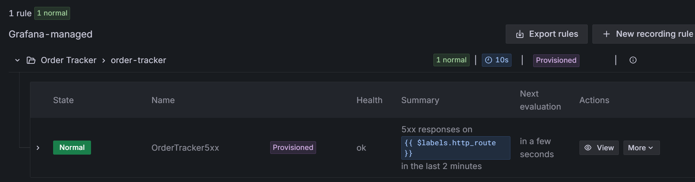

# Homework 4: DevOps and Observability for AI-Built Apps

Source: [Order Tracker](https://github.com/ketut-garjita/order-tracker), a small app for creating orders and checking their status. 
The starter has a web page, API, tests, and a Docker Compose setup.

## Question 1: Run the app

Start Order Tracker:

```bash
docker compose up --build -d --wait
```

Now check it:

```bash
curl http://localhost:8000/healthz
```

What does the health check return?

- `{"status":"ok"}` ✅
- `{"status":"error"}`
- `{"orders":3}`
- `pong`

### Solution:

```bash
curl http://localhost:8000/healthz
```
```text
{"status":"ok"}
```

## Question 2: Instrument one endpoint

Imagine a customer says they cannot open an order. You check the website and everything looks okay. We need a better way to undestand what's happening in the system. For that we use metrics, logs and traces.

Ask your agent to add OpenTelemetry metrics, logs, and traces for order lookups. The request metric should include the route and HTTP status code.
For now, export the signals to the console so you can inspect them with `docker compose logs app`.

After the agent's changes, rebuild the app with `docker compose up --build -d --wait`.

Then lookup the order `standard-1001`:

```bash
curl -i http://localhost:8000/api/orders/standard-1001
```

Find the request metric in the app logs.

Which HTTP status code does the metric record for this lookup?

- 200 ✅
- 301
- 404
- 500

### Solution:

- Create requirements.txt
```text
opentelemetry-sdk
opentelemetry-exporter-otlp
opentelemetry-instrumentation-fastapi
opentelemetry-instrumentation-sqlite3
```
```bash
uv add --requirements requirements.txt
```
```bash
uv lock
```
```text
Resolved 45 packages in 169ms
```

- Alternatively, edit Dockerfile:
```text
FROM python:3.12-slim

COPY --from=ghcr.io/astral-sh/uv:0.8.22 /uv /uvx /bin/
WORKDIR /app
COPY pyproject.toml uv.lock ./
RUN uv sync --frozen --no-dev
COPY app ./app
COPY static ./static
ENV ORDER_DB_PATH=/data/orders.db

COPY requirements.txt .
RUN pip install --no-cache-dir -r requirements.txt

EXPOSE 8000
CMD ["uv", "run", "--no-sync", "uvicorn", "app.main:app", "--host", "0.0.0.0", "--port", "8000"]
```

```bash
docker compose down
docker compose docker compose up --build -d --wait
```

- Create app/telemetry.py

- app/main.py. Add these lines right after app = FastAPI(...):
```text
import logging
from opentelemetry.instrumentation.fastapi import FastAPIInstrumentor
from app.telemetry import setup_telemetry

logger = logging.getLogger("order-tracker")

setup_telemetry()
FastAPIInstrumentor.instrument_app(app, excluded_urls="healthz")
```

- compose.yaml, under app.environment:
```text
PYTHONUNBUFFERED: "1"      # otherwise console output may not appear in docker compose logs
OTEL_EXPORTER: console     # change to "otlp" in Question 3
# OTEL_EXPORTER_OTLP_ENDPOINT: http://otel-collector:4318
```

```bash
docker compose up --build -d --wait
```

- curl -i localhost:8000/api/orders/standard-1001
```bash
curl -i http://localhost:8000/api/orders/standard-1001
``` 
```text
HTTP/1.1 200 OK ✅
date: Wed, 30 Sep 2026 04:35:01 GMT
server: uvicorn
content-length: 149
content-type: application/json

{"id":"standard-1001","customer":"Avery","item":"Notebook","priority":"standard","status":"received","created_at":"2026-09-30T03:27:33.451878+00:00"}(.venv) deai@LAPTOP-GMRKPETB:~/pr
```

```bash
docker compose logs app
```
```text
app-1  | INFO:     127.0.0.1:40718 - "GET /healthz HTTP/1.1" 200 OK ✅
```

## Question 3: Build the telemetry pipeline

In Question 2, we looked at the logs to see the telemetry. Let's now save it into a proper telemetry storage.

Ask your agent to add an OpenTelemetry Collector, Prometheus, Loki, Tempo, and Grafana to Docker Compose. Send the app's metrics, logs, and traces through the Collector, and create a Grafana dashboard for request counts and errors. Save the configuration in your repository.

Rebuild the stack with `docker compose up --build -d --wait`, then run:

```bash
curl -i http://localhost:8000/api/orders/standard-1002
```

In Grafana, find the request metric for this lookup. Check that its log and trace also appear. Which HTTP status code does the metric show?

- 404 ✅
- 200
- 301
- 500

### Solution:

- build the telemetry stack
  ```text
                    ┌──────────────┐
                    │ Order Tracker│
                    │   FastAPI    │
                    └──────┬───────┘
                           │
                 OTLP metrics/logs/traces
                           │
                           ▼
                 ┌───────────────────┐
                 │ OpenTelemetry     │
                 │ Collector         │
                 └─────┬─────┬───────┘
                       │     │
             ┌─────────┘     └──────────┐
             ▼                          ▼
        Prometheus                    Loki
          metrics                       logs
             │                          │
             └──────────┬───────────────┘
                        │
                        ▼
                      Grafana
                        ▲
                        │
                      Tempo
                      traces
  ```

  A sensible repository layout is:
  
  ```text
  order-tracker/
    ├── app/
    │   ├── main.py
    │   └── telemetry.py
    ├── observability/
    │   ├── otel-collector-config.yaml
    │   ├── prometheus.yml
    │   ├── loki-config.yaml
    │   ├── tempo-config.yaml
    │   └── grafana/
    │       ├── provisioning/
    │       │   ├── datasources/
    │       │   │   └── datasources.yaml
    │       │   └── dashboards/
    │       │       └── dashboards.yaml
    │       └── dashboards/
    │           └── order-tracker.json
    └── compose.yaml
  ```

- Modify Compose and test

  Add:
  
    ```text
      otel-collector
      prometheus
      loki
      tempo
      grafana
    ```
  
  The application should send:
  
    ```text
    app
     │
     ├── metrics ──┐
     ├── logs ─────┼──> OTEL Collector
     └── traces ───┘
    ```
  
  The Collector then routes them:
  ```
  metrics → Prometheus
  logs    → Loki
  traces  → Tempo
  ```
  
  Grafana gets the three data sources.
  
  Rebuild containers
  ```bash
  docker compose config
  docker compose up --build -d --wait
  ```
  Then check:
  ```bash
  docker compose ps
  ```
  and:
  ```bash
  curl http://localhost:8000/healthz
  ```
  Grafana will be available at:
  ```text
  http://localhost:3000
  ```
  with the default credentials from the Compose configuration:
  ```text
  username: admin
  password: admin
  ```
  ```bash
  curl -i http://localhost:8000/api/orders/standard-1002
  ```
  ```text
  HTTP/1.1 404 Not Found ✅
  date: Wed, 30 Sep 2026 11:29:16 GMT
  server: uvicorn
  content-length: 28
  content-type: application/json
  ```

## Question 4: Configure the alert

The dashboard shows errors when you open it, but it does not notify anyone on its own. An alert watches the `5xx` metric and changes state when server errors occur. Later, Grafana will send an HTTP request called a webhook to the responder so it can start investigating automatically.

Ask your agent to add a Grafana alert for `5xx` responses. Include the endpoint, time window, and dashboard link in the alert, and handle periods with no `5xx` responses. For now, check the alert's state in Grafana. You will connect it to the responder in Question 6.

Run the lookup from Question 3 again:

```bash
curl -i http://localhost:8000/api/orders/standard-1002
```

Wait for the alert to evaluate. What state does Grafana show?

- Normal ✅
- Firing
- Pending
- No data

### Solution:

```text
Q3 = 404
Alert condition = 5xx
404 does not trigger a 5xx alert
```


## Question 5: Build the automatic responder

When an alert fires, the on-call engineer needs to look into it and solve it. If they cannot do it, they escalate it to developers.

In our case, we'll have an agent that's doing exactly that.

Ask your coding assistant to build a service in `incident-response/` that receives alerts from Grafana at `POST /alerts` on port `8001`. When an alert arrives, it should save the information needed to understand the problem, such as the affected endpoint, logs, and traces.

On alert, the service should start the coding assistant automatically in headless mode.

When it's done, start the responder. We want to test it. Send an alert to the responder:

```bash
curl -X POST http://localhost:8001/alerts \
  -H 'Content-Type: application/json' \
  -d '{"alerts":[{"status":"firing","labels":{"alertname":"ResponderTest","test":"true"},"annotations":{"summary":"Test notification; no incident to fix"}}]}'
```

Wait for the agent to finish, then read its response.

What did the agent respond? Include the last line from its answer.

### Solution: 

Create ./incident-response.run.sh
  ```bach
  #!/usr/bin/env bash
  cd "$(dirname "$0")"
  exec uv run uvicorn main:app --host 0.0.0.0 --port 8001
  ```
Exec uv run
  ```bash
   ./incident-response/run.sh
  ```
  ```text
  INFO:     Started server process [11139]
  INFO:     Waiting for application startup.
  INFO:     Application startup complete.
  INFO:     Uvicorn running on http://0.0.0.0:8001 (Press CTRL+C to quit)
  INFO:     127.0.0.1:45122 - "POST /alerts HTTP/1.1" 200 OK
  ```

Test curl in another terminal:
  ```bash
  curl -X POST http://localhost:8001/alerts \
    -H 'Content-Type: application/json' \
    -d '{"alerts":[{"status":"firing","labels":{"alertname":"ResponderTest","test":"true"},"annotations":{"summary":"Test notification; no incident to fix"}}]}'
  ```
The agent respond?:
```
No application code was changed. No fix is required. I did not run tests because there was no code change to verify. The workspace already contains unrelated modifications; I left them untouched.
```
The last line from its answer:
 ```
The workspace already contains unrelated modifications; I left them untouched
```

## Question 6: Watch the agent fix the incident

Now test the complete flow with a real Grafana alert.

Connect the Grafana alert to the responder through a webhook.

Let's make this request:

```bash
curl -i http://localhost:8000/api/orders/express-1002
```

This request is problematic and should cause the alert to fire. If it doesn't repeat it multiple times. Then watch Grafana send the webhook to `/alerts`, and the responder start automatically.

Wait for the agent to fix the problem, restart the app and verify that the same request doesn't cause the problem to appear.

What was the problem?

- The express delivery date calculation tried to use a day that does not exist in that month. ✅
- The order timestamp could not be parsed because it had no time zone.
- The app rejected the order's `preparing` status.
- The lookup searched the wrong database column for express orders.

### Solution:

```bash
curl -i http://localhost:8000/api/orders/express-1002
```
```text
HTTP/1.1 200 OK
date: Thu, 01 Oct 2026 07:54:24 GMT
server: uvicorn
content-length: 182
content-type: application/json
{"id":"express-1002","customer":"Sam","item":"Headphones","priority":"express","status":"preparing","created_at":"2026-08-31T03:27:33.451878+00:00","estimated_delivery":"2026-09-02"}
```

The fix worked. The request that previously resulted in a 500 error now returns a "200 OK" with `"estimated_delivery":"2026-09-02"`. The date is correct: `created_at` was August 31st, and adding 2 days results in September 2nd. With the old code, the calculation 31 + 2 = 33 yielded a date that doesn't exist in any month, which is what caused the 500 error.
The "Connection reset by peer" error on the first line almost certainly occurred because the app was restarting (rebuilding the container), and the second, successful `curl` request confirms this.

Answer Q6
```
The express delivery date calculation tried to use a day that does not exist in that month.
```

Exec uv run
  ```bash
   ./incident-response/run.sh
  ```
Test curl in another terminal:
  ```bash
  curl -X POST http://localhost:8001/alerts \
    -H 'Content-Type: application/json' \
    -d '{"alerts":[{"status":"firing","labels":{"alertname":"ResponderTest","test":"true"},"annotations":{"summary":"Test notification; no incident to fix"}}]}'
  ```
Check logs:
  ```bash
   $ ls -al
  total 44
  drwxr-xr-x 2 deai deai 4096 Oct  2 14:23 .
  drwxr-xr-x 3 deai deai 4096 Oct  2 14:23 ..
  -rw-r--r-- 1 deai deai 7806 Oct  2 14:23 agent-response.txt
  -rw-r--r-- 1 deai deai  237 Oct  2 14:23 alert.json
  -rw-r--r-- 1 deai deai  136 Oct  2 14:23 incident.md
  -rw-r--r-- 1 deai deai  277 Oct  2 14:23 last-message.txt
  -rw-r--r-- 1 deai deai 4407 Oct  2 14:23 logs.txt
  -rw-r--r-- 1 deai deai  112 Oct  2 14:23 traces.txt
  -rw-r--r-- 1 deai deai 1626 Oct  2 14:23 verification.txt
  ```
  
  ```bash
  tail -n 10 agent-response.txt
  ```bash
  tail -n 10 agent-response.txt
  ```
  ```text
      "completedJobs": 3,
      "totalJobs": 3
    }
  }
  codex
  This is a responder test: `alert.json` has `test: "true"` and says “Test notification; no incident to fix.” The logs contain no entries, and the traces list is empty.
  
  No root cause or real incident is indicated. No fix is required; I made no code changes and ran no tests.
  tokens used
  4,969
  ```
  
  ```bash
  cat verification.txt
  ```
  ```text
  exit=0
  ...                                                                      [100%]
  =============================== warnings summary ===============================
  .venv/lib/python3.14/site-packages/fastapi/testclient.py:1
    /home/deai/projects/order-tracker/.venv/lib/python3.14/site-packages/fastapi/testclient.py:1: StarletteDeprecationWarning: Using `httpx` with `starlette.testclient` is deprecated; install `httpx2` instead.
      from starlette.testclient import TestClient as TestClient  # noqa
  
  .venv/lib/python3.14/site-packages/starlette/testclient.py:53
    /home/deai/projects/order-tracker/.venv/lib/python3.14/site-packages/starlette/testclient.py:53: DeprecationWarning: The anyio.abc.BlockingPortal alias is deprecated, use anyio.from_thread.BlockingPortal instead.
      _PortalFactoryType = Callable[[], AbstractContextManager[anyio.abc.BlockingPortal]]
  
  app/telemetry.py:34
    /home/deai/projects/order-tracker/app/telemetry.py:34: DeprecationWarning: Use ConsoleLogRecordExporter. Since logs are not stable yet this WILL be removed in future releases.
      return ConsoleSpanExporter(), ConsoleMetricExporter(), ConsoleLogExporter()
  
  .venv/lib/python3.14/site-packages/opentelemetry/sdk/_logs/_internal/__init__.py:615
    /home/deai/projects/order-tracker/.venv/lib/python3.14/site-packages/opentelemetry/sdk/_logs/_internal/__init__.py:615: DeprecationWarning: `LoggingHandler` in `opentelemetry-sdk` is deprecated. Use the handler from `opentelemetry-instrumentation-logging` instead.
      warnings.warn(
  
  -- Docs: https://docs.pytest.org/en/stable/how-to/capture-warnings.html
  3 passed, 4 warnings in 0.26s
  ```
  
  ```bash
   cat last-message.txt
  ```
  ```text
  This is a responder test: `alert.json` has `test: "true"` and says “Test notification; no incident to fix.” The logs contain no entries, and the traces list is empty.
  No root cause or real incident is indicated. No fix is required; I made no code changes and ran no tests.
  ```

The last line of its answer is: 
  ```text
  No root cause or real incident is indicated. No fix is required; I made no code changes and ran no tests. ✅
  ```
